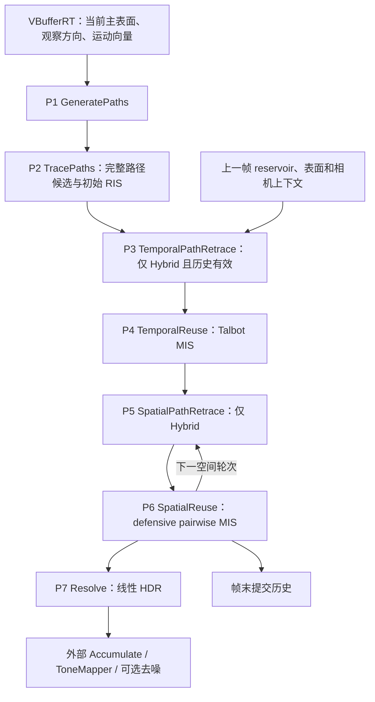

# MyPT 向 GRIS / ReSTIR PT 迁移的开发计划

编写日期：2026-09-08  
状态（2026-09-13）：M1–M5 保持原验收结论；M0 的跨版本同场景原始 HDR、参数与材质对照已完成。M6 已完成生命周期/参数绑定修复、三光组登记范围内的能量确认、最终原入口/边界回归及性能测量，UI 仍只有原 PT / ReSTIR。同 GPU 时间校准失败，正式比较未启动；DI 分工、部分末端 RC 与性能差距仍在，M6 整体效果/性能对齐未达成。详见[M6 实施与验收记录](C:/Users/13243/Desktop/Restir/Falcor/Source/RenderPasses/MyPT/GRIS_round5_results.md)。

历史状态（保留原 2026-09-10 记录，不作为当前结论）：状态（2026-09-10）：M1–M5 已在各轮声明的支持范围内完成。M5 经完整恢复验收通过：同冻结构建的四组核心统计、新的全部 27 项边界、图像、Layered 和原入口检查均通过，原中断记录保留。继续在原有 PT / ReSTIR 上增量修改，不增加 UI 渲染模式。M0 的跨版本同场景 HDR 对拍及 M6 完整画质/性能对齐仍未完成；本轮详见[第四轮记录](C:/Users/13243/Desktop/Restir/Falcor/Source/RenderPasses/MyPT/GRIS_round4_results.md)。

## 1. 目标、范围与参考基线

目标是在现有 MyPT 的 ReSTIR 模式内改进实现，以现有对外 Falcor RenderPass 管理多个独立 GPU pass，逐阶段实现参考工程的完整路径采样、时间复用、空间复用和 Hybrid Shift，并通过可复现的测试对齐图像能量、降噪表现和动态稳定性。UI 的 Mode 保持 PT / ReSTIR 两项，不新增 ReSTIRPT、PTReference 或平行的 PT 产品入口。

GRIS 是理论框架；本计划的具体算法基线是用户提供的 2022 年 ReSTIR PT 实现，采用 `PathSamplingMode::ReSTIR` 分支。先对齐该分支，再考虑其他方法。资料定位如下：

- 当前项目：`C:/Users/13243/Desktop/Restir/Falcor`，计划初建时的基线 HEAD 为 `901e4e96a40e3a27a6a9d9f34a9e0718381984e9`；各轮实施版本见对应验收记录和 source_state.json。
- 参考项目：`C:/Users/13243/Desktop/Restir/ReSTIR_PT`，HEAD 为 `8d12332228eb64bc234e27c6f7e0913a926285ab`。该工作区另有核心 API、构建及 Mogwai 文件的本地修改；引用以本次读取的源码为准。
- 理论依据：本地 `C:/Users/13243/Desktop/Restir/sig22_GRIS.pdf`，重点为 §4.3–4.4、§5.6、§6.2–6.5、§7、§8.1–8.3。
- 本文源码链接定位到实际文件和起始行；后续修改可能使行号变化，应优先按函数名查找。

保留现有 PT 执行入口，将现有 ReSTIR 的一跳候选和融合调度逐步替换为完整路径候选与分 Pass 调度。提取并复用已有材质加载、光源采样、可见性和 BSDF 处理；只为 GRIS 必需的样本描述、reservoir 权重及 Pass 边界新增模块，不另起一套互不关联的追踪器。被替代的旧 ReSTIR 调度和无用资源及时删除；旧版本用 Git 基线对照，不额外增加 Legacy 模式。当前 PT 的能量划分仍需核对，不能仅因它名为 PT 就当作绝对真值。

本次修订的具体约束：沿用 `mode`、`giRISCandidateCount`、`maxBounces`、`computeDirect`、`useImportanceSampling`、`useMIS` 等已有参数；新增参数只用于原实现缺少的功能（例如固定随机种子）。`maxBounces=0` 保持直接光语义，内部 surface-scatter 上限为 `maxBounces+1`。RR 的验收配置显式设为 0，不能静默忽略 UI 参数。尚未实现的时空复用控件不作为当前有效功能展示。

本计划区分三类事项：

- **参考实现已有**：本次已从参考代码确认的机制。
- **本项目设计**：为适配当前 Falcor 和逐 pass 调试而采用的组织方式。
- **后续扩展**：在基本效果对齐之后再做，不计入首个正确版本。

## 2. 已核对的现状与迁移边界

### 2.1 实施前的 MyPT 基线

本小节记录 Git `901e4e96` 的问题定位，C01–C06 链接指向实施前的只读快照；第一轮之后的实际状态见验收记录。

- [MyPT.cpp 的调度][C01]：两个 ray-generation dispatch，分别完成初始采样加时间复用、空间复用加着色。
- [GIPathReservoir][C02]：保存第二顶点的位置、法线、缓存的出射辐射以及权重；没有完整路径类型和重放种子。
- [samplePathRIS][C03]：从主表面采一个 BSDF 方向，命中第二顶点后取 emission 与直接光；没有继续生成完整多跳候选。
- [tracePath 的模式分支][C04]：ReSTIR 模式使用一跳 GI reservoir，普通 PT 分支才执行由 Max bounces 控制的继续追踪。
- [mergeGIPathReservoir][C05]：已有几何 Jacobian 比例，但归一化使用近似的来源目标函数；未重算连接顶点的方向相关 BSDF，未测试新连接线段的遮挡。
- [GI closest-hit][C06]：第二顶点有辐射截断；DI 与 GI 的发光面命中可能重叠，第二顶点 NEE 的 MIS 也缺少对应的继续 BSDF 采样贡献。这些问题应在新候选生成器中统一处理。

已有的场景绑定、V-buffer 输入、材质加载、光源采样和缓冲管理直接复用或抽取为共享函数。旧 GI 的样本定义及近似合并公式需要替换为参考的完整路径与 PSS 权重。

### 2.2 参考实现的真实结构

- [ReSTIRPTPass::execute][R01] 依次执行生成起点、追踪候选、可选时间复用、若干轮空间复用。
- Hybrid 模式先执行相应 Retrace，再执行 Reuse；该模式在调度中设置空间 Pairwise MIS、时间 Talbot MIS。
- [TracePass::tracePath][R02] 在一个 pass 内循环处理整条路径，不要求每个 bounce 单独 dispatch。
- [PathBuilder][R03] 在路径生成过程中从路径贡献中选取样本；[writeOutput][R04] 再处理多个候选路径树之间的合并和最终归一化。
- [TemporalReuse][R05] 计算跨上下文的目标函数与 Jacobian，使用 generalized Talbot MIS。
- [SpatialReuse 的 Pairwise 分支][R06] 固定中心 canonical 样本，计算双向 shift，执行 defensive pairwise MIS。
- 最终颜色在参考的追踪或复用阶段输出。本项目增加独立 Resolve pass，便于查看任一阶段输出；它属于组织调整。

## 3. 每帧执行架构

### 3.1 对外接口与内部组织

对外保留一个 MyPT RenderPass，由 `MyPT.cpp/.h` 统一管理 scene、参数、资源、历史和 pass 调度。内部使用独立 shader entry 和 GPU dispatch，每个 pass 有独立 profiling 名称。

新分支优先采用 ComputePass 加 inline ray query，与参考计算阶段的组织方式保持接近。当前 Falcor 的 [SceneRayQuery][C07] 已提供求交和可见性查询；program、scene modules 和 type conformances 的绑定方式参考当前项目的 [PathTracer::updatePrograms][C08]。旧版参考的 BSDF 和材质接口需要适配当前版本。



上图展示全部启用的依赖关系。实际旁路规则：

- 关闭时间复用或历史无效：P2 的输出直接进入空间阶段。
- 关闭空间复用：最后一个有效 reservoir 阶段直接进入 P7。
- 关闭全部复用：P2 → P7。
- Reconnection / RandomReplay 模式：跳过 P3、P5；相应 shift 在 Reuse 的共享函数中求值。
- Hybrid 模式：每次 Reuse 消费紧邻它之前、针对同一输入集合生成的 Retrace 缓存。
- 第一版限定每像素一个最终 reservoir。以后增加 samplesPerPixel 时，应同步扩展样本索引、缓冲及历史，不能只把整个循环重复执行。

### 3.2 CPU 调度草案

以下为目标职责划分，尚非实现代码：

```text
beginFrame(): 更新场景资源、判断历史有效性、初始化本帧状态
executeGeneratePaths()
executeTracePaths()                         // 写 ReservoirA
current = ReservoirA
scratch = ReservoirB

if temporalEnabled && historyValid:
    if shift == Hybrid:
        executeTemporalPathRetrace(current, HistoryPrev)
    executeTemporalReuse(current, HistoryPrev, scratch)
    swap(current, scratch)

for round in enabledSpatialRounds:
    if shift == Hybrid:
        executeSpatialPathRetrace(current, round)
    executeSpatialReuse(current, scratch, round)
    swap(current, scratch)

executeResolve(current)
commitHistory(current, currentPrimaryContext)
endFrame()
```

多轮空间复用的输入、邻居 reservoir 和 canonical 样本均来自该轮冻结的 current；任何轮次都不得就地读写同一组空间 reservoir。

### 3.3 缓冲所有权与生命周期

- `PrimaryContextCurrent`：当前 V-buffer / 观察方向及必要的主表面缓存。
- `PrimaryContextPrev`：历史 V-buffer、上一帧相机和必要的历史上下文。仅保存位置和法线不足以完成严格的反向求值。
- `PathReservoirA/B`：本帧候选、时间复用及空间复用的 ping-pong 缓冲。
- `PathReservoirHistoryPrev`：本帧全程只读。帧末从最终 reservoir 复制，或在所有消费者结束后交换所有权。
- `ReconnectionCache`：每个 pair 两个方向的前缀命中、方向、throughput 和有效性。每轮重建；不能沿用上一轮 reservoir 的缓存。
- `NeighborPlan`：本项目建议显式记录空间邻居索引、有效性与顺序，供 Retrace / Reuse 共用。参考通过一致的邻居生成规则重建邻居；两种做法都必须保持完全对应。
- `UnresampledContribution`：背景、主表面 emission、明确排除在路径 reservoir 外的 direct / delta-direct 等贡献，具体分工见第 4.4 节。
- `DebugOutput`：选定阶段的 F、W、M、路径长度、重连位置、Jacobian、失败原因等。需要保留中间图像时显式复制，不能指向随后被覆盖的 ping-pong 数据。

采用反射验证 structured buffer 的 stride、数组长度和布局。[ReflectTypes][R14] 是参考的资源反射辅助，不是每帧算法阶段。初期以字段可读和布局正确为先，不照抄 88B/256B 等尺寸。

所有 early return 都必须有已定义的输出：背景像素、无样本像素、无历史像素、无有效邻居像素和失败 shift 分别处理。通过当前 Falcor 的资源状态管理保证 dispatch 之间的写后读依赖，不使用 CPU 等待逐像素串行化 GPU。

## 4. 在拆 pass 前固定共享数学与数据约定

### 4.1 路径与 reservoir

按 [PathReservoir][R07]、[PathState][R08] 和 PathBuilder 的用途建立新结构：

- 完整路径的可重建描述：初始随机种子、重连后随机种子、路径长度、重连索引、终止方式。
- 重连顶点描述：可重建 HitInfo、后缀方向、后缀贡献、必要的光源 PDF 与 Jacobian 缓存。
- 路径事件：delta、反射/透射、所采样 lobe、NEE / BSDF 命中 / 环境终止。
- 当前上下文下的 RGB 贡献 `F`、归一化贡献权重 `W`、置信权重 `M`。

完整路径可通过“重连顶点 + 种子 + 类型”描述，不要求存储所有顶点。参考的 `rcVertexIrradiance` 在不同终止分支有不同因子分解；迁移时逐分支写明已经包含或排除的 BSDF、PDF、MIS 和 RR 因子，不能把它简单等同于旧 `Lout`。

源 reservoir 与源上下文在 shift 期间保持只读。shift 输出新的描述和 F；被选中后一起写入目标 reservoir，防止“新 F + 旧重连信息”混用。

### 4.2 PSS 参数化与 Jacobian

改造后的 ReSTIR 采用参考的 primary sample space（PSS）定义。理论依据为 GRIS §8.1、公式 52–54。

- PSS 中路径构造已把方向采样 PDF 等因子计入被积函数；均匀随机数的密度为 1。
- 目标函数统一使用 `toScalar(F)`。第一版对齐参考的标量化系数，后续如改用当前 Falcor 的 luminance，需独立记录其方差影响。
- [纯 RandomReplay][R09] 在参考的 PSS 定义下使用单位 Jacobian；不能把该结论直接用于立体角参数化。
- [Reconnection][R10] 先计算几何比例，再按具体连接和终止类型乘相应 BSDF PDF 比例，并重算连接两端的 BSDF。
- NEE、环境、delta 和 RR 分支有各自规则。公式中因子的加入位置以参考调用链为准；旧 GI 的几何比例不能直接和新 PSS 权重拼接。

调试版提供 `ShiftResult`：变换后的路径、F、Jacobian、是否在映射定义域内及失败原因。失败映射、可见性为零、目标函数为零应可区分，便于核对 MIS 支持域。

### 4.3 权重生命周期

参考的 `weight` 在累积期间表示权重和，结束后表示贡献权重。新代码建议使用独立 accumulator，避免把归一化 W 误当成 weightSum。

对齐 [reservoir 合并与 finalize][R11] 的两条不同路径：

- 基础 `merge`：候选权重含 `pHat(F_shifted) × J × M_source × W_source × misWeight`，配套 RIS 归一化。
- `mergeWithResamplingMIS`：候选权重含 `pHat(F_shifted) × J × W_source × misWeight`；M 的作用已进入相应 resampling MIS 构造，不能再盲目乘一次。
- `finalizeRIS`：按 `pHat(F_selected) × M` 归一化。
- `finalizeGRIS`：在已经正确构造 resampling MIS 的前提下，仅按 `pHat(F_selected)` 归一化。
- Pairwise 分支还有参考代码暂未纳入逐项权重的 `validNeighborCount + 1` 补偿，迁移时必须完整保留其含义。

M 表示复用置信权重，不等同于实际追踪射线数，也不等同于统计独立样本数。参考 PathBuilder 将一棵初始路径树的结果置为 M=1，多个候选树再合并。不得仅因旧代码出现 `setM(1)` 就判定其错误。

本轮未选到非零贡献与“没有采样尝试”是不同状态。参考 add/merge 在部分零权重返回之前会更新 M；候选数、失败映射和零贡献的规则应逐分支迁移，不能统一丢弃后重算分母。

### 4.4 光照贡献分工

[参考演示脚本][R15] 使用独立 ScreenSpaceReSTIRPass，把 `directLighting` 输入 ReSTIRPTPass；路径追踪内另有 `LDeltaDirect` 等不能简单交给 DI 的贡献处理。[相关代码][R16] 显式区分可被光源采样的路径和其他分量。

本项目分两步建立可对照基线：

1. 在迁移现有追踪逻辑时提供同一候选流的 PTReference / InitialRIS 两种内部输出，关闭复用。PTReference 是可选诊断纹理，不是新的 UI 模式。逐项核对可见 emission、主表面 NEE、BSDF 命中发光面、间接 NEE、环境和 delta 路径的归属。
2. 再建立“间接路径 reservoir + 相同 direct 输入”的比较模式，按参考规则排除重叠的直接光路径，并保留必要的 delta-direct 补充。完整画面阶段再接入经过验证的 DI 模块。

当前 MyPTRestir DI 在方向重建和权重方面仍需独立验证，不直接作为新分支的总亮度真值。新路径候选中必须解决发光面重复计数、只有 NEE 的 MIS 半份贡献、环境路径遗漏和辐射硬截断。关闭 RR 建立第一版有限路径长度基线，之后按参考正确计入 RR。

迁移参考的直接光裁剪分支时必须连同使用条件一起核对。例如 PathTracer.slang 第 1025 行会抑制特定的首次非 delta 反射发光面命中；其用途与独立 DI 输入相关，不能孤立复制到没有外部 DI 的完整光照基线，否则会漏掉路径。每种输出应明确它积分的路径集合。

## 5. 七个 GPU pass 的实施规格

### P1. GeneratePaths

**参考怎么做：** [GeneratePaths][R17] 从主命中和相机信息建立初始路径状态，处理有效像素、路径 ID 和背景输出。

**本项目工作：**

- 输入当前 V-buffer、viewW、frame/sample 索引和参数，构造主表面与可确定重建的采样起点。
- 初始化本帧 reservoir、辅助输出及无效像素；初始化职责只执行一次，避免后续 pass 再次清除有效结果。
- 与已有 VBufferRT 共用主命中，明确是否已有像素抖动，避免重复采样相机射线。

**输出：** 主表面上下文、初始路径/种子以及背景所需数据。

**验收：** 有效像素掩码、位置、法线、观察方向与输入一致；重置后相同输入和种子可复现；无主命中时输出有定义。

### P2. TracePaths

**参考怎么做：** [TracePass][R02] 循环遍历整条路径，通过 PathBuilder 处理 NEE / emission / escape 候选；[writeOutput][R04] 处理候选树间 RIS。

**本项目工作：**

- 把旧 closest-hit 内的一跳逻辑迁移为共享的迭代式完整路径追踪函数。
- 建立新 PSS 贡献、初始 RIS、重连点描述和重放种子；候选树数与最终输出样本数分开配置。
- 让 PTReference 与 InitialRIS 使用同一材质和采样实现，以隔离框架迁移误差。

**输出：** ReservoirA、明确划分的非复用贡献、可选 PTReference 图像。

**验收：** P1 → P2 → P7 可独立运行；改变候选数不产生持续能量漂移；直接、间接、环境和路径长度分组均通过第 8 节基线。

### P3. TemporalPathRetrace

**参考怎么做：** [TemporalPathRetrace][R18] 为中心路径到历史上下文、历史路径到当前上下文分别重放前缀；需要时缓存 ReconnectionData。

**本项目工作：**

- 与 P4 共用同一次重投影对应关系。先保存来源索引或保证两阶段采用同一确定性算法。
- 在 Hybrid 模式按源路径种子重放前缀，记录双向重连前顶点、方向、throughput、有效性。
- 没有历史或不需要重放时输出确定的空缓存/单位前缀，不读未初始化数据。

**输出：** 双向时间前缀缓存；不修改 reservoir 的归一化权重。

**验收：** 固定样本可对照参考的重连索引和终止原因；同上下文重放恢复同一条路径。

### P4. TemporalReuse

**参考怎么做：** [TemporalReuse][R05] 对中心及历史候选计算 Talbot MIS，包括反向 shifted integrand、J 和 `p_self / p_sum`，最后 finalizeGRIS。历史 M 按 `historyLength × currentM` 截断。

**本项目工作：**

- 加载当前与上一帧主表面上下文，完成 shift、连接可见性、完整 F/J 更新及 MIS。
- 使用当前 reservoir 作为 canonical 输入；消除 `p_hat_at_prev ≈ p_hat_at_cur` 的近似。
- 历史无效时保留初始 reservoir，不能让整像素变黑；输出写入 scratch。

**输出：** 时间复用后的当前域 reservoir。

**验收：** identity、无历史、完全失败历史、零贡献输入和普通两候选场景；改变历史长度后长期均值稳定；相机运动及遮挡显露的行为有可重复记录。

### P5. SpatialPathRetrace

**参考怎么做：** [SpatialPathRetrace][R19] 按每个邻居存储 `data[2*i]` 与 `data[2*i+1]`，分别对应两个方向的前缀。

**本项目工作：**

- 针对本轮冻结的 current 生成 NeighborPlan，并在 Hybrid 模式重放每个 pair 的双向前缀。
- 候选顺序、源 reservoir、随机种子、round 索引与 P6 一致。
- 将几何上可纳入的邻居与 shift 成功的邻居分开记录；两者不能混作 Pairwise 的计数。

**输出：** 本轮邻居对应关系、双向前缀缓存。

**验收：** 缓存与邻居一一对应，边界/自邻居/无效像素不越界；换轮后不存在旧缓存污染。

### P6. SpatialReuse

**参考怎么做：** [Pairwise 分支][R06] 冻结 centralReservoir；先评估中心到邻居以构造 canonicalWeight，再评估邻居到中心构造 neighborWeight，最后加入中心样本并归一化。

**本项目工作：**

- 通过统一 Shift 函数计算双向贡献、PDF/Jacobian 和可见性。
- 按参考顺序构造 defensive pairwise 权重，保留中心保护项和邻居数补偿。
- 一个线程只写自己的输出元素，所有邻居来自本轮只读输入。结束后才交换 current/scratch。
- 关闭空间复用或 neighborCount=0 时直接旁路，避免公式中的 neighborCount 除零。
- 中心零贡献时也不能仅凭“reservoir 无选中样本”就跳过整个空间阶段；按所定义的置信权重和支持域规则处理。

**输出：** 当前空间轮次的最终 reservoir。

**验收：** 一个固定邻居起步，之后测试多邻居和多轮；交换处理次序的统计结果一致；重复邻居、无效邻居、failed shift 的计数行为可解释。

### P7. Resolve

**参考怎么做：** 参考在 PathTracer::writeOutput 和 Reuse 中输出 `F × weight`，并合入 directLighting 等分量。

**本项目设计：**

- 独立 Resolve 只读取已归一化、已更新到当前上下文的 reservoir，输出 `F × W + 非复用贡献`。
- 正确性阶段的可见性已经包含在相应路径求值中；Resolve 不再次合并 reservoir，不再次除 M。
- 允许选择 Initial / Temporal / SpatialRound 输出用于调试；只提交最终有效阶段的结果到历史。

**输出：** 线性 HDR、选定的调试视图。

**验收：** 同一 reservoir 从不同显示入口解析得到相同值；曝光不参与估计器；直接/间接分量之和与总输出一致。

## 6. 共享文件与工程接入计划

在现有 MyPT 目录按需新增 `GRIS/` 子目录，下面是职责划分，不要求创建所有文件。先从 MyPT.rt.slang 提取可共享的材质/光照代码，再新增必要的 Pass 和 reservoir 模块；禁止为凑架构增加空壳文件：

- 七阶段 shader：`GeneratePaths.cs.slang`、`TracePaths.cs.slang`、`TemporalPathRetrace.cs.slang`、`TemporalReuse.cs.slang`、`SpatialPathRetrace.cs.slang`、`SpatialReuse.cs.slang`、`Resolve.cs.slang`。
- 路径基础：`PathState.slang`、`PathReservoir.slang`、`PathBuilder.slang`、`PathTracer.slang`。
- 共享求值：`LoadShadingData.slang`、`Shift.slang`、`ResamplingMIS.slang`。单独抽出 ResamplingMIS 是本项目设计，用于防止时间和空间阶段各自维护不一致的公式。
- 配置与反射：`Params.slang`、`StaticParams.slang`、`ReflectTypes.cs.slang`。

修改现有 `MyPT.cpp/.h` 中 ReSTIR 分支的资源和调度；修改 CMakeLists 声明所需文件并验证 shader 拷贝及 import 路径。用户入口仍为 `scripts/MyPT.py`，默认使用改造后的 ReSTIR；PT 可在原 Mode 控件选择。验收辅助脚本仅用于原始 HDR 和统计，不引入新的 UI 模式。主验收场景为用户指定的 `media/test_scenes/tutorial.pyscene`，再用 Cornell Box 等隔离具体光路。

第一版共享配置至少包括：

- Mode 仍为 PT / ReSTIR；沿用原候选数、bounce、MIS 等配置。ShiftStrategy、最终样本数限制及各 bounce 类型限制按对应里程碑加入。
- TemporalEnabled、TemporalReprojectionEnabled、SpatialEnabled、SpatialRounds、NeighborCount、Radius、HistoryLength。
- TemporalMIS=Talbot、SpatialMIS=Pairwise；第一版不开放未经验证的任意组合。
- RoughnessThreshold、DistanceThreshold、FeatureRejection、固定种子、ResetHistory。
- NEE / MIS / RR、直接光分工、DebugStage、DebugQuantity。

场景加载/重载、尺寸变化、模式和采样域相关参数变化时重置历史。相机平滑运动正常走重投影；相机跳切单独失效。帧末提交历史是资源管理步骤，不必增加一个只为复制缓冲的 shader。

随机数规则必须可重放：候选路径、reservoir 选择、邻居选择使用明确区分的随机流；保存路径所需的种子与采样约定。采用与参考相容的确定性 BSDF 求值，调试输出不得消耗路径随机数。不能把“随机流前进固定 64 维”当作跨阶段不重叠或独立性的证明。

## 7. 实施里程碑与依赖

以下为开发顺序；最终帧内仍按第 3 节先时间、后空间执行。

### M0. 固定对照基线与数学约定

- [x] 保存当前和参考的参数、场景/相机、材质与光源配置、版本及截图/原始 HDR；M6 已完成实际跨版本对照。参考完整属性 getter 不可用的字段以源码核对的请求配置与可观察 readback 区分记录，未伪造 getter 成功。
- [x] 明确路径长度计数、PSS 的 F/W/M 语义、光照分工和零贡献规则。
- [x] 建立无累积、无去噪、固定曝光的调试脚本；跨版本材质/HDR 对照已完成。M6 显式匹配参考 Lambert、完整 BSDF、路径截断和光照分工；不表示两版默认材质或噪声逐路径相同。
- [x] 按第 8 节固定共享场景、ROI 与门槛，参考程序已实际完成三光组和 realtime/offline 对照。中央 ROI 未触发暗区分支；该分支和未登记材质/场景保持未覆盖。

**完成条件：** 有可重复的对照命令和参数记录；尚无实测时明确标为“未测”，不以文档描述当作通过。

M0 当前完成证据：[三光组 raw 合同](C:/Users/13243/Desktop/Restir/Falcor/build/gris-m6-final-review/additional_light_groups_raw_audit.json)、[12 组同配置检查点 HDR 比较](C:/Users/13243/Desktop/Restir/Falcor/build/gris-m6-final-cpu/same_configuration_support_gate_v1/summary.json)及[参考物理配置源码记录](C:/Users/13243/Desktop/Restir/Falcor/build/gris-m6-reference/final_alignment_notes.md)。M1–M5 和第一轮任务中的“跨版本未测”保留为当时历史状态，以本节及 M6 最新实测状态为当前结论。

### M1. 调度骨架与基础类型

- [x] 在现有 ReSTIR 中接入共享类型、compute program 创建和布局反射；Mode 保持 PT / ReSTIR。
- [x] 接通 P1/P2/P7 的基础路径追踪入口；本轮不执行时间/空间复用。
- [x] 明确当前帧资源所有权、profiling 和诊断输出；历史资源待接入复用时创建。

**依赖：** M0。  
**完成条件：** 编译加载成功；主表面与背景正确；无未初始化输出；原模式仍可运行。此阶段不宣称完成 GRIS。

### M2. 完整路径候选与初始 RIS

- [x] 完成 PathTracer / PathBuilder / PathReservoir 的完整候选流与 PSS 权重。
- [x] 处理 emission、NEE、环境、delta-direct 和候选树合并，去除旧一跳 Lout 限制。
- [x] P1 → P2 → P7 与共享 PTReference 通过本地能量验收；完整参考程序的跨版本对拍仍单列为未测。

**依赖：** M1。  
**完成条件：** 多跳和候选数变化均通过；保存独立种子结果及统计报告。未通过前不增加时空复用掩盖问题。

### M3. 纯 Reconnection 与空间 Pairwise

第二轮实施约束（2026-09-09，对照 `Shift.slang::computeShiftedIntegrandReconnection`、`SpatialReuse.cs.slang` 的 Pairwise 分支、`PathReservoir.slang::mergeWithResamplingMIS/finalizeGRIS`）：

- 在现有 ReSTIR 的 P1 → P2 → P7 中插入 P6 SpatialReuse；纯重连直接读取主表面，不创建 P5 Retrace。UI 仍只有 PT / ReSTIR，启用原有空间邻居、半径及几何阈值参数，增加空间开关和轮次。
- 保留完整候选生成器与初始 RIS。将固定重连点前后事件单独保存，补充前端 PDF、重连点 PDF、几何项；紧接重连点的 BSDF 命中光源/环境需缓存不含终止 MIS 的后缀，在 shift 中重新计算 MIS。多轮选中样本必须写回目的空间的 F 和 Jacobian 元数据。
- Falcor 8 的 `StandardBSDF.sample()` 返回选中 lobe 的权重与混合 PDF，而 shift 求完整 BSDF。StandardMaterial 连续事件的候选 throughput 因此改为完整 `eval/pdf`（delta 保留原权重），统一候选与 shift 的测度；同树 PTReference 随之更新，均值应保持，单帧不要求与第一轮历史图逐位相同。另在 MyPT 共享 PDF helper 中修正该版本 StandardMaterial reference sampling 对透射返回负 PDF 的符号。其他材质保留原采样权重；本轮仅允许 StandardMaterial 作为重连的两端，分层材质的近似 PDF 不用于该映射。
- 主表面自发光、主表面 NEE，以及重连点前后 delta 路径暂不做跨像素映射，采用对称的失败支持域。保留它们在原 reservoir 中，通过参考 defensive canonical 权重保留本像素贡献；不能依据中心抽中何种路径跳过整轮。无需改变直接光分工，也不使用缓存旧方向 Lout。
- 初始树到达固定 rc 后，用与 shift 相同的可见性规则检查存储顶点重建的源连接。若浮点重建或端点偏移使其被相邻几何遮挡，明确标记为本地路径，由 canonical 保留其贡献；不扩大射线终点容差放过遮挡，也不允许只能单向成立的映射进入复用。
- 冻结中心样本；几何合法邻居先计数，再进行双向 shift。失败、零贡献和零 M 不混同于几何无效。合并权重为 `pHat(Fshift) * J * Wsrc * MIS`，不重复乘 M；最后除选中目标值以及 `validNeighborCount + 1`，不再除累计 M。
- 每轮只读输入、单线程写本像素输出，使用独立 scratch ping-pong；空间关闭、邻居数为零、轮次为零时完整旁路。先用固定偏移验证，再测随机邻居、重复/无效邻居和多轮。
- 增加可选诊断输出用于检查初始结果、有效/成功邻居、同上下文贡献重建误差和跨像素往返 Jacobian/贡献误差。自身像素用解析恒等映射 J=1，跨轮累计最大误差。保存独立种子能量结果，继续将跨 Falcor 版本的完整参考 HDR 对拍列为未完成。

- 本轮启用参考 `Shift.slang:556` 的对称 Jacobian 拒绝规则，采用参考阈值 10，即 `max(J, 1/J) <= 11`，另留 `1e-5` 相对浮点边界容差。Falcor 8 的极端粗糙透射 PDF 在同一上下文重评时可能产生相对误差；拒绝这类映射并由 canonical 保留原贡献，不裁剪辐射值。此支持域限制必须在材质回归和第二轮结果中明确记录。

- [x] 实现连接两端 BSDF/PDF、几何与 PSS Jacobian、可见性和终止分支。
- [x] 完成 P6，先固定一个邻居，再启用邻居分布和多轮 ping-pong。
- [x] 验证双向求值、支持域及 canonical 权重；P5 在该模式下无需执行。

第二轮验收已通过，详见 [GRIS_round2_results.md](C:/Users/13243/Desktop/Restir/Falcor/Source/RenderPasses/MyPT/GRIS_round2_results.md)。五组必需能量测试、全部数值/边界检查及原 MyPT.py 入口通过；均匀透射的小预算能量回归仍为统计精度不足，不声称完整材质画质已对齐。

**依赖：** M2。  
**完成条件：** 静态漫反射及遮挡场景通过能量测试；glossy 测试可以噪声较大，但不能用旧方向 Lout 近似代替正确求值。

### M4. 时间 Talbot 与历史管理

第三轮实施约束（对照参考 TemporalReuse 的 Talbot 分支与 ReSTIRPTPass.cpp 帧末历史保存）：

- 扩展原流程为 `GeneratePaths → TracePaths → TemporalReuse → SpatialReuse × rounds → Resolve`；仍只保留 PT / ReSTIR 模式。纯重连不增加 TemporalPathRetrace，P3 留到 M5。
- 历史 reservoir 和历史 PrimaryPathContext（hit 与实际 direction）独立保留至本帧所有 pass 结束；下一帧历史取本帧最终空间结果。fresh 始终保留作初始 RIS 对照。
- 历史 M 仅在读取时限制为 `min(history.M, historyLength * fresh.M)`，不修改历史 W。Talbot 对当前和历史做双向 shift 后合并，最终不除 2、不除 M。合法历史的零贡献/失败 shift 仍累计 M；无合法历史时完整旁路。
- 使用已有 mvec 输入的归一化 current→previous 偏移；缺输入时按上一帧无抖动 VP 投影静态世界坐标。随机取整前检查有限值与屏幕范围。历史命中、材质、法线和同一历史相机空间的深度用于拒绝不相符的表面。只有 hit 与实际射线方向完全相同才使用恒等映射。
- 场景切换、尺寸/参数变化、相机实质参数变化、几何/材质/光照变化清空历史；相机移动允许重投影，每帧 Jitter/History 更新不清空历史。本轮不复用已改变的几何/材质/光照后缀，也不扩展 DOF 历史复用。
- 增加可选 temporalColor / temporalDebug 输出，验证 temporal-only、spatial-only、二者结合、历史上限、重置、相机运动与显露区域；统计单位为独立完整 seed 序列，不把相关历史帧当独立样本。

- [x] 完成 P4 和历史主表面重建；先使用纯 Reconnection。
- [x] 处理首帧、无效历史、参数重置、相机移动和遮挡显露。
- [x] 按参考 historyLength × currentM 规则处理时间置信权重。

第三轮验收已通过，详见 [GRIS_round3_results.md](C:/Users/13243/Desktop/Restir/Falcor/Source/RenderPasses/MyPT/GRIS_round3_results.md)。25 项边界检查、四组必需能量对照及原 MyPT.py 入口通过；首轮统计精度不足的两组使用新的独立种子完成固定预算确认，两份报告分别保留。M4 仍限定为纯重连，不代表 Hybrid、任意动态场景或跨版本完整画面对齐。

**依赖：** M3。  
**完成条件：** 分别记录 spatial-only、temporal-only、temporal+spatial 的结果；独立运行统计不显示持续能量偏移。

### M5. Random Replay 与 Hybrid

第四轮实施约束（2026-09-09，对照参考 PathTracer 的 replay / Hybrid 选点与 Shift）：

- 沿用原 PT / ReSTIR 模式，在 ReSTIR 内增加 Shift strategy：Reconnection / RandomReplay / Hybrid。切换策略或阈值重置采样和历史；原脚本本轮最终启用 Hybrid，旧脚本未声明策略时仍使用 Reconnection。
- RandomReplay 复用现有候选追踪循环，从 initialSeed 恢复指定的逻辑贡献槽：路径长度、NEE/BSDF-arrival 类别及 NEE 光源分支。不能重新执行 RIS 选择另一个贡献，也不能按“第几个非零贡献”或旧 terminalSeed 匹配。重放与生成执行同一 NEE/BSDF/RR 随机数消费，PSS Jacobian 为 1。
- 本轮对应参考 separatePathBSDF=false 分支，保留当前完整 BSDF / mixture PDF 估计器。按材质 roughness、连接距离选择第一个有限表面重连点，单独保存并检查 delta 和反射/透射事件。参考默认的分量拆分配置需要成套的分量 eval/pdf 与 MIS，不混用到现有估计器。
- Hybrid 保存广义 rcIndex、前一顶点命中/观察方向、前缀吞吐及后缀。双向重放到 rcIndex-1，检查更早重连点、终止和粗糙度分类变化；连接段另检查距离、事件类型、可见性、Jacobian 支持域。被移位的样本保留固定重连后缀，不能在重连失败时改用完整 Replay。
- 有限 rc 的前缀限定为 Standard 材质，并校验源/目的连接前 RNG 状态一致，避免可变采样维度错配。包含非 Standard 前缀的候选归入 noRC 完整 Replay；这类材质的有限 rc Hybrid 不在本轮支持范围内。
- 未选到有限表面重连点的贡献使用完整 Replay，并要求目的贡献仍属于无重连点分区。BSDF 恰在首次可连接表面发光终止、尚无更早有限 rc 时，该贡献也改记 noRC；已有较早有限 rc 的发光或环境后缀仍保留该 rc。本轮未实现参考额外的发光/逃逸终端 rc 表示，包括无限远 rc。
- P3/P5 实际 dispatch 写入双向前缀缓存，P4/P6 读取同一邻居对应。每轮冻结输入、重新生成缓存，所有无效槽均明确初始化；保留原 Talbot / Pairwise 权重生命周期。
- 增加可选重放/Hybrid 诊断，验收真实 identity 重放、往返 F/J、分区拒绝、深重连点、镜面/透射前缀、近场、RR、时间/空间组合和原入口。身份检查必须绕过“直接拷贝相同像素”的快捷路径。
- 数值一致性修正限制在 GRIS 的共享材质求值入口：对 Standard 材质最终 shading frame 的世界到局部方向变换使用明确顺序的 precise 标量乘加，继续调用 Falcor 原有材质准备、半球检查和 StandardBSDF eval/pdf；生成、Replay 与重连共用。该调整针对已复现的近掠射角跨 Pass 浮点误差，不复制源 F、不放宽 1e-3 门槛、不另写 BSDF 物理模型；原 PT 模式保持现有入口。
- 固定有限 rc 缓存视角无关的原始表面数据（位置、UV、未调整 TBN、原 tangentW、未翻转 faceN），生成与双向移位共用；每个目的视角仍重新计算 V/frontFacing 并执行材质 setup。该缓存是 Falcor 8 数值适配，参考自身仍由 rcHit 重建。不得缓存旧视角的最终材质法线；几何/材质变化继续失效历史。新增存储代价在 M6 记录。

- [x] 先完成纯 RandomReplay，验证同上下文路径恢复和 PSS 单位 Jacobian。
- [x] 按 [参考可连接性与可逆性逻辑][R12] 实现 roughness、distance、整材质分类下的 delta / 反射透射事件、重连索引和终止类型约束。
- [x] 接入 P3/P5 的双向前缀缓存，与 P4/P6 共用对应关系。
- [x] 记录不可逆、路径长度不匹配、delta 不可重连等失败原因。

第四轮验收通过，详见 [GRIS_round4_results.md](C:/Users/13243/Desktop/Restir/Falcor/Source/RenderPasses/MyPT/GRIS_round4_results.md)。最终审计状态为 `passed_with_retained_interruption`：131,072 帧核心统计、新进程完整 27 项边界、同构建图像/Layered/原入口及人工图像检查通过；原中断的 20 项不计入通过数量。支持范围仍为本节声明的整材质 Hybrid 与 noRC Replay，不表示参考默认分量拆分、额外终端 rc 或完整画质/性能已对齐。深 rc 与镜面/透射计数属于路径生成覆盖，不能代替各类前缀的跨像素接纳证明。

**依赖：** M4 和确定性的完整路径采样。  
**完成条件：** 本轮声明的支持域和已记录配置内，成功映射通过往返检查；glossy、镜面/透射链路和近距离几何通过图像验收。

### M6. 完整效果对齐与性能收敛

#### M6 实施顺序与比较约定（2026-09-10，实施前补充）

1. 保留 M5 的源码冻结、失败过程与最终验收文件，M6 的新证据写入独立目录。先记录当前二进制及成功重复编译的内存基线，再以局部 RAII 修复 `ProgramManager` 的编译请求所有权；覆盖成功、失败及异常退出，验证请求释放后的反射与实际 dispatch，以及同进程反复重建的资源趋势。
2. 在原 MyPT 上增加可选测量输出和只读缓存信息，不增加渲染模式。射线按初始路径、时间前缀、时间连接、空间前缀、空间连接、额外验证、普通 PT 分组；计数只在实际发射处递增。失败率采用非零源路径的实际 shift 次数作分母。时间测试关闭全部会增加追踪的诊断输出，并与计数测试分开。
3. 比较前显式统一材质和直接光：参考 Falcor 4.4 默认 Lambert，当前 Falcor 8 默认 Frostbite。新增脚本可选 Lambert 对齐配置，默认材质行为不变；参考采用 `separatePathBSDF=false`，两端匹配有限路径截断、RR=0、Center/1、Mip0。反弹计数按实际循环核对：当前 `maxBounces=8` 内部传 9，对应参考 `maxSurfaceBounces=8`，两者均包含深度 0..8 的 NEE 与第 9 条 BSDF 扩展上的发光到达，不能直接对齐内部常量。修正现有普通 PT 的 seed 参数未接入问题，以便获取真实独立运行。先比较间接光，再分别验证解析光、发光面、环境光和合成的完整 HDR。参考外部 DI 的资源依赖及内部/外部开关必须显式记录，禁止重复相加。
4. 使用同机器、共享静态场景，保存两端原始 HDR、配置和来源哈希；测量 realtime（N1/K3/R1/H20）和 offline（N32/K6/R3、关闭时间复用），同时比较同配置和同 GPU 时间的误差。先做小分辨率试运行，再按独立完整种子序列累积；初始预算为 8 个种子、每种子 256 帧，参考原生 PT 间接部分每帧 64 spp；完整光照另加下面预注册的 DI 预算，不能称为总共 64 spp。若第 8 节的 1% 区间或参考精度不足，按相同协议增加预算，不能改门槛。暗区以线性 RGB 均值小于 0.001 定义，绝对误差容差 0.0001。预算与实际执行状态均保留，不以样本不足替代通过。
5. 根据实测 GPU 时间、射线、缓存和失败率选择局部优化，验证优化前后 HDR 与诊断等价；保留原有材质数值稳定性修复。记录终端 rc 表示、组件拆分、DI 所有权和两个 Falcor 版本的其余差异。原始 HDR 是验收输入，NRD 仅在有明确显示需求时另接，不能修正或掩盖估计器误差。
6. 将全部实测结果、最终脚本参数、已通过/失败/样本不足/未测项目写入 M6 结果文档，并复核原 `MyPT.py` 启动入口。只有满足现有完成条件后才勾选对应项目。

完整直接光对照修订（实施前，旧 full 配置尚未执行）：源码核对发现参考 `disableDirectIllumination=false,useDirectLighting=false` 不等于完整光照。primary NEE 未进入参考 ReSTIR reservoir（`PathBuilder.slang:123` 拒收长度 0）；native PT 的首次普通反射发光面命中又在 `PathTracer.slang:1025` 被关闭，不能只恢复内部 NEE 的 MIS 半份贡献。旧 full 配置无效，不用于验收，也不放宽 1% 门槛。原 Demo 的外部 DI 为 `ScreenSpaceReSTIRPass`，但其没有公开独立 seedOffset。本轮共享 opaque rough、无相机可见发光体/背景场景采用现有第二个 `ReSTIRPTPass` 输出 NEE-only DI：native PathTracing，四项 max bounce 全为 0，NEE 开、MIS 关、BSDF importance 开，内部直接光开、外部 DI 关、T/S 关；在首个普通反射 scatter query 前按原有最后顶点规则终止。其 color 接主参考 GI 的 directLighting；主参考算法和 PT baseline 均设内部直接光关、外部 DI 开。参考工程源码与 DLL 不改。

完整光照固定预算为算法 GI 原配置 + DI1 spp，baseline GI64 spp + DI64 spp。GI seeds 保持 `[1103,2203,3301,4409,5501,6607,7703,8803]`，对应 DI seeds 固定为 `[1001103,1002203,1003301,1004409,1005501,1006607,1007703,1008803]`；每个种子 256 帧、无排除 warmup。DI seeds 不沿用同一条重置后的序列。完整图 GPU 时间包含 DI Pass，同时单列 DI / 主 PT 时间，父图与子阶段不可重复相加。正式 full 运行前用新输出目录完成低预算 DI 正值、full=GI+DI（只加一次）及同 seed 原始输出重放检查。新 helper 前版本、旧未执行 full 配置和已执行 indirect 的全部哈希保存在 `build/gris-m6-reference/external_di_revision/before`；indirect 的属性、图和预算含义不变，已跑证据不重写。详细公式/末端表示与限制见 [源码对齐记录](C:/Users/13243/Desktop/Restir/Falcor/build/gris-m6-reference/final_alignment_notes.md)。

实施记录：第一版仅将编译请求改成作用域 RAII，在隔离的核心 A/B 测试中触发启动阶段访问异常（`build/gris-m6-memory/after`，退出码 `0xC0000005`），尚未进入场景测试。该版本不构成修复通过；必须补齐 Slang 编译会话与反射所依赖对象的所有权，并先通过启动和生命周期回归，再继续资源与画质验收。失败目录保留，后续采用新输出目录。

后续稳定性记录：`after_session` 保留会话后完成了 4 次图重建，图像哈希与旧构建一致，但第 5 次重建仍以 `0xC0000005` 退出，不能据前几轮内存趋稳判定修复通过。新增的 ShaderString 生命周期测试与 RootBufferParamBlock GPU 测试通过（前者 6 个执行通过、1 个原有跳过，后者 4 个通过），但不覆盖该长进程崩溃。下一步先保存异常调用栈，并排除修改公共 C++ 类型布局后旧插件与新核心混用的影响；任何涉及布局的最终验证都必须使用一致重建的依赖二进制。补充核查反射 layout 的确切 component 所有者，以及内核、PSO 和延迟释放资源所依赖的会话生命周期。故障未定位并通过同进程复测前，本项保持未完成。

反射所有权复现：`build/gris-m6-memory/slang-composite-probe/results` 的 8 组 CPU 对照始终保留 session、global 和 entry component；4 组保留确切 composite 的测试全部通过，4 组释放它后再查旧 layout 的测试全部失败（布局地址复用为其他入口或访问异常）。据此修复 `createProgramKernels()` 返回后 `ProgramReflection` 仍借用局部 composite 布局的问题：反射对象必须持有其确切 layout 所有者和关联会话，不能只保留语义相同的 constituent components。该复现证明这一生命周期缺口，不单独证明它就是 Mogwai 第 5 轮崩溃的唯一原因。

GFX 缓存修复约定（实施前补充）：精确版本 Slang 2024.1.34 的 `RendererBase::createMutableShaderObjectFromTypeLayout()` 使用设备会话缓存外部布局，缓存 key 为布局裸地址；现有 Falcor 参数块通过此接口创建，编译会话释放后存在地址复用风险。改用显式传入所属会话的公开接口前，验证原布局与生成布局的字段、数组、资源绑定和嵌套参数块一致。为避免正确持有会话后重复图重建保留多份相同导入模块，在 `ProgramManager` 仅按完整编译配方复用会话（深值配置、完整源模块内容/路径和有序参数），暂不合并任意不同程序。缓存命中检查依赖文件修改，热重载清理相应缓存，失败编译不能留下污染的可复用条目。补充同名生成模块但不同内容、宏/参数变化、导入文件修改、失败后恢复及同会话重复编译测试；最终仍以原有资源预算和长进程工作负载验收，不通过永久保留全部旧请求解决崩溃。

测量前补充：参考 `PathTracer.slang:1249` 的 Hybrid 前缀在 NEE 前返回，`:1269` 的 RandomReplay 仅对目标 NEE 贡献槽执行可见性，其余步骤仅推进随机数。当前共享 trace 循环的无用查询可能被 Slang 的 `__NoSideEffect` 优化删除，而外加原子计数仍存活。为避免报告不存在的射线，在插桩验收前显式按 `PathBuilder` 的贡献槽过滤控制查询：finite-prefix 不发 NEE 可见性，完整 replay 只检查目标 NEE，忽略的贡献不发可见性；保留各光源采样和 BSDF 求值的随机数消耗及顺序。目标 NEE 完成后的无用末段查询也显式跳过，保留原采样状态推进。该处理先验证输出与映射一致性，性能结论仍由实测给出。

独立种子运行补充：增加脚本方法 `resetSampling(seed)`，在保留场景、程序和配置的情况下重置 PT 帧号、GRIS 帧号和历史，并发出原有采样刷新标志。数值批次按完整种子轨迹调用此方法，避免仅换运行时 seed 也重建整组 shader。插桩检查需对比该重置与原 `updatePass` 重建的同种子结果；编译资源压力测试仍使用原先的完整图重建协议。

生命周期验收结果：统一 ALL_BUILD 后，编译请求 RAII + owned session + exact layout owner + 显式 GFX API2 + 完整配方会话缓存组合在 `build/gris-m6-memory/after_session_cache/report.json` 完成原固定 8 图重建，837.563 秒、runtime_unchanged=true，峰值私有内存 5,407,604,736 字节，预热后释放点净增 58,834,944 字节，低于原 8 GiB 上限；8 图颜色哈希均与旧构建相同。CompileSessionCache 3 项、ShaderString 7 项执行（另 1 原有跳过）、ParameterBlockSession 1 项、ParamBlockCB 1 项、RootBufferParamBlock 4 项通过。该项可记为规定工作负载通过，不宣称全部内存无泄漏。更高优先级 import 路径新增遮蔽文件需 force reload；`ProgramReflection.mpProgramVersion` 仍为借用，其全部 API 不能脱离版本生命周期使用。

发光面可见性修复（实施前）：跨版本相机 ROI 深度逐位相同，但独立 8×256×64 初始路径均值仍显著低于参考，不能进入效果通过结论。CPU float32 几何复现确认，当前 `pathVisible` 偏移起点后仍使用原始采样方向/距离，仅缩短 `1e-5`；Falcor 8 的起点偏移为旧版 3 倍，shared 场景地板和箱顶的可见射线会先撞到光源自身。普通 PT 的同类阴影射线甚至保留整个原始距离。按参考 `PathTracer.generateEmissiveSample():627–631` 的双端偏移构造公共发光面可见性射线：偏移着色点和光源点，重算方向/长度；两条现有渲染路径共用，仅修正可见性段，BSDF/PDF/描述符仍按原采样点求值。环境/解析光与有限 RC 重连另有各自语义，不统一扩大 epsilon。修复前 HDR、时序和射线数据保留，修复后重新运行独立 PT 能量、完整/间接计数隔离及 M5 边界/原入口回归；不能把修复前后颜色变化作为逐位等价通过。

实测局部优化（实施前）：修正发光面可见性后，640×360 realtime 间接光的 MyPT 平均 6.451 ms，SpatialReuse 占 3.368 ms，是主要成本；TemporalPathRetrace 仍占 0.249 ms。16 帧计数中，时间复用只有 230 个非恒等方向尝试，却执行了 101,215 条前缀最近命中射线和 36,357 条前缀阴影射线。现有 TemporalReuse 已在 primary hit 和 direction 完全相等时直接使用恒等映射，完全不读两个重放结果。将相同判据提取共用，并让 TemporalPathRetrace 在这一情形保留 pair 状态/邻居、跳过不用的前缀；不改变后续 MIS、历史权重、选择随机数或诊断路径。修复前后正式 profile 使用完全相同配置与预算，检查普通末帧及 16 帧 HDR 逐位一致、其它射线/失败计数不变、时间前缀射线减少；时间差只作为实测描述，不用一次运行宣称独立统计加速。空间重连的必要可见性和完整材质求值仍是主要成本，本次不降低邻居数或牺牲采样配置换速度。

局部优化验证补充：普通末帧和 16 帧 HDR 已逐位一致；原“只有时间 prefix 两分量减少”的计数断言实际未满足，应保留而非改写成通过。除最近命中 101,215→9、普通阴影 36,357→3，时间 connection 还减少 113 次（339→226）。源码核对说明 noRC prefix 的重放也会为源 RC 支持域执行 reconnectionVisible；这些同属随后不被消费的前缀内部查询。其余 ray 分量与全部 shift 分量逐元素一致。计数通道按查询类型与时间/空间阶段分类，不能机械地映射成某一个 Pass；最终报告将明确这一点。正式能量门槛和逐位 HDR 验证不变。

统计门控补充（实施前）：进一步确认 Hybrid compact noRC prefix 的返回值只消费 replayFound、rcIndex、F、terminal、light。其 atRc 支持可见性仅影响 rcBeforeFlags 和缓存 PDF，返回值不使用这些字段；`traceVisibilityRay` 标为 `__NoSideEffect`，存在编译器删除查询但保留计数的风险，不能把旧 113 次增量称为已实证的硬件射线。给共享 trace 增加默认开启的 evaluateSourceSupport，仅 Hybrid prefix 调用关闭，以独立嵌套 if 同时跳过这一查询和计数；完整 generation/Replay 保持原行为，atRc 的运输重参数化和全部随机状态保留。参考批次全部完成后主动停止了自有的下一项插桩进程，原因与 PID 核对记录在 `build/gris-m6-final/intentional-queue-stop.json`；不是新的崩溃。最终当前批次、插桩、性能和边界在新输出目录运行，参考源码/helper 未变的已完成结果继续使用。

首轮能量记录：修补上述统计门控前，发光面 6 组主输出有 5 组满足原 ±1% 区间条件，realtime/indirect 为精度不足；三个区间上界约 1.282%、1.295%、1.659%，不记为通过，也不放宽门槛。同 seed 重跑不会增加独立证据。完成最终固定 8×256 矩阵后，如仍不足，将对该配置另行预登记独立种子、固定更长轨迹的确认批次，旧批次保留且不用于选择中途停止时刻；确认的具体预算在其执行前写明。

#### M6 最新实测状态（2026-09-13）

本节更新当前完成状态；前面的实施前约定、失败过程和旧预算统计全部保留。报告与源码哈希描述各自运行时身份，后续仅写回文档不应被称为 shader 变化。

三光组 emissive/analytic/environment × baseline/realtime/offline × indirect/full 共 18 项主输出，原 8×256 预算为 14 项通过、4 项统计精度不足，没有将不足改成通过。随后三个 realtime indirect 与 environment realtime full 各自另行登记 8×4096 条件，共 131,072 帧，四项最终 color 及四阶段共 16 项检查全部进入原逐 RGB ±1% 区间；参考自身 95% 相对半宽均小于 0.25%。原 256 帧样本不合并、不覆盖，不使用中途误差决定停止。该结论限于所登记场景、材质和中央 3,456 像素 ROI；六份参考均值的 ROI 暗像素数均为 0，因此 RGB<0.001 的绝对 0.0001 暗区门仍未覆盖。证据：[四项独立 raw/区间审计](C:/Users/13243/Desktop/Restir/Falcor/build/gris-m6-final-review/final_confirmation_raw_audit.json)、[暗区覆盖](C:/Users/13243/Desktop/Restir/Falcor/build/gris-m6-final-cpu/dark_roi_coverage_support_gate_v1.json)。

最终 support-gate shader 已完成 16 进程/344 帧的有限预算回归，包含 27 项 Hybrid/Replay/Reconnection 边界、5 项 temporal reset、三种 Layered 策略各 20 帧和原 MyPT.py/tutorial 入口 18 帧。已实际查看最终原入口 PNG，物体和显示输出正常，短累积仍有噪声。该检查不替代材质长期能量或整体收敛；原截图的 0x18 访问异常缺少该次转储，不能仅凭地址唯一归因。已复现的生命周期/参数绑定缺口与原固定 8 图工作负载的修复证据独立保留。见 [最终边界审计](C:/Users/13243/Desktop/Restir/Falcor/build/gris-m6-final-review/final_bounded_regression_audit.json)、[最终入口截图](C:/Users/13243/Desktop/Restir/Falcor/build/gris-m6-regression/final-support-gate/entry/MyPT-entry.ToneMapper.dst.0.png)。

最终 20 个 profile、四组插桩和当前批次共 30 份结果已核验原始时间/计数与构建身份。以下比例是既有计时实现的描述性记录；后来发现参考读回同步缺口，精确帧对应尚未独立确认，不能将这些比例当作最终同时间验收。640×360 下当前完整图/参考完整图耗时：realtime indirect 2.674750、full 2.608140；offline indirect 1.898288、full 1.956803。SpatialReuse 是主要差距之一。实际 GRIS buffers 为 realtime 333,619,200 bytes、offline 351,129,600 bytes，不代表总显存；GPU 时间不把父图与子 Pass 重复相加。恒等前缀与 compact-prefix 支持查询门控已经实施并验证原始 HDR 等价，但最终 support-gate 单次 profile 没有显示加速，既有 profile 仍显示与参考有差距，精确比例待有效计时复测。见 [逐 Pass 性能/查询/失败率记录](C:/Users/13243/Desktop/Restir/Falcor/build/gris-m6-final-review/final_performance_draft.md)。

物理分工已经逐项核对：两端本轮使用 separatePathBSDF=false；当前部分发光/无限远终止归入 noRC Replay，参考另有终端 RC 表示。完整图当前将短 DI 与 GI 一起参与 reservoir，参考为 GI 复用后另加独立 DI-only 输出。参考完整图预算是算法 GI+DI1，高样本基线 GI64+DI64；不能简称总 64 spp。DI positivity、full=GI+DI 一次相加和原始输出检查已经执行，这些测试不会消除估计器结构差异。NRD 为可选后续显示，当前不以其修正原始 HDR。见 [M6 实施与验收记录](C:/Users/13243/Desktop/Restir/Falcor/Source/RenderPasses/MyPT/GRIS_round5_results.md) 的物理配置与 DI 段。

同时间旧 v1/fix1 只保留作校准/描述性证据：第一版在 current Accumulate outputFormat 枚举转 JSON 时失败；修正后前 9 项通过，第 10 项 reference offline indirect 同进程 reset 的逐位门失败，后续未跑。顶层 RNG 构造器输入与有限参考基线存在交集，不能称 fresh 独立质量通过。旧 bitwise 失败、8×256 精度不足及原预算都没有被重写。

参考重置诊断共有三个独立版本：首版因旧 Texture.width getter 需要 mip 参数在第 33 次调用失败；probe-fix1 的 original 变体完成 42 次调用但在第二次 profiler 辅助 NaN 的 JSON 序列化失败；probe-fix2 以显式 nonfinite tag 保留辅助统计并保持有效成本严格 finite，实际两个变体共 84 次调用完成。新两图内外的四帧及均值全部逐位相同，并等于两个旧失败进程的 repeat 1；旧 repeat 0 的前 3 帧与均值仍不同。instrumented 新数据的 packed VBuffer、depth 与公开 camera 全相同，但这一轮没有复现 HDR 微差，旧失败又没有逐帧 primary，不能因此定位旧差异的内部原因，也不能泛化为“随 repeat 稳定”或“fresh process 天然逐位确定”。见 [probe-fix2 完整诊断审计](C:/Users/13243/Desktop/Restir/Falcor/build/gris-m6-final-cpu/reference_reset_probe_fix2_audit.json)、[全部捕获文件复核](C:/Users/13243/Desktop/Restir/Falcor/build/gris-m6-final-cpu/reference_reset_probe_fix2_source_audit.json)。新实际 profiler 未出现非有限 tag，tag 分支由 CPU 反例覆盖。

同 GPU 时间验收当前未通过。fresh_calibration_v1 登记 80 个独立进程，前 33 项通过，第 34 项 reference realtime full seed 300007 的计时加和检查失败，后 46 项未启动；实际共 5,278 次 render 调用。失败进程完成 223 次调用并正常退出，但业务状态是 failed，不能记为校准通过。旧 worker 在严格解码后才保存 raw Profiler，因此失败时间序列未落盘，不能判断超差幅度或具体帧。正式注册检查已拒绝该队列，四组最终 N 均为 null，正式同时间图像比较未启动。证据：[计时失败独立审计](C:/Users/13243/Desktop/Restir/Falcor/build/gris-m6-final-review/fresh_calibration_timestamp_failure_audit_v1.json)、[正式注册拒绝](C:/Users/13243/Desktop/Restir/Falcor/build/gris-m6-final-review/fresh_formal_readiness_after_timestamp_failure_v1.json)。

参考计时源码另发现同步缺口：D3D12GpuTimer::apiResolve 将 ResolveQueryData 放入命令列表后立即 Map 读回，而该 Read buffer 的 Map 不负责等待 GPU。Profiler 又使用上一帧的双缓冲事件槽，因此旧读回值可能无法对应所假定的帧。这里是源码发现的风险，不能凭缺失的失败记录确认它就是本次异常的唯一原因。Direct3D 12 要求应用负责 CPU/GPU 访问同步，见 [Microsoft Map 文档](https://learn.microsoft.com/en-us/windows/win32/api/d3d12/nf-d3d12-id3d12resource-map)。同步修订的构建和诊断状态单独记录；原参考 DLL、原门槛和失败证据保持原样。

独立诊断 fix1 已完成 10 项 CPU 测试和输入检查，固定一次 223 calls，保存顺序为 raw Profiler → mean/last/depth → 原严格 decoder → 全 lane 诊断；原 v1 顺序缺口已保留，两个版本均未运行 GPU。诊断即使成功也不具备校准替代资格。见 [诊断说明](C:/Users/13243/Desktop/Restir/Falcor/build/gris-m6-reference-timing-probe-fix1/README.md) 及 [独立复审](C:/Users/13243/Desktop/Restir/Falcor/build/gris-m6-final-review/reference_timing_probe_fix1_framework_review_v1.json)。

同步修订仅在工作区 build/gris-reference-timer-sync-candidate-v1 中制作独立候选：Resolve 后显式标记 pending commands，再 flush(true) 等待，最后 Map。实际编译和链接均返回 0；4,801 个导出名称/序号、40 个依赖与原 DLL 相同，8,974 条原参考及构建输入的前后哈希全部未变。候选状态是 cpu_candidate_built_not_gpu_validated，没有部署到当前或参考程序；它尚未证明时间帧对应、渲染等价或旧异常根因。逐事件等待还会改变提交节奏，不能预先称性能等价。见 [候选构建报告](C:/Users/13243/Desktop/Restir/Falcor/build/gris-reference-timer-sync-candidate-v1/build_report.json)。

本次收尾时另一个 Material 项目的 Mogwai 仍在运行，GPU 诊断暂停。该进程在 11:36:40 才启动，晚于 11:33:08–11:33:26 的旧校准失败，不构成旧失败的解释。本次文档写回会改变 Source 文档身份，写回前的两份原文及其余 Source 哈希单独归档；上述已登记未运行的诊断绑定写回前身份，后续应在新目录重新登记实际输入并先检查，不编辑旧 manifest 绕过冻结检查。

后续顺序为：保存完整原始计时的独立诊断 → 验证所使用计时实现的帧对应及严格加和 → 在登记的新身份下完成全部四组校准 → 只按时间选择固定 N → 完成正式轨迹的实际时间与 HDR 误差比较。平均时间差 ≤2%、每条配对轨迹 ≤5% 的条件保持不变，不用同帧数 MSE、最近检查点或旧局部通过数据代替有效同时间结果。M6 的整体效果/性能对齐仍未达成。

- [x] 统一或记录 separatePathBSDF、终端 RC 与 DI 分工差异，匹配 realtime/offline 配置并完成共享三光组原始 HDR 比较；已比较不代表逐路径、方差或全部效果相同。
- [x] 单独验证参考 DI 输入及仅加一次的完整 HDR 合成，并完成共享场景完整图比较；当前 DI/GI 共用 reservoir 与参考外部 DI 分工仍不同。NRD 本轮无新增显示需求，未接入，不用于掩盖误差。
- [x] 记录每 Pass GPU 时间、查询数、缓存大小和失败率，完成恒等前缀/无用支持查询局部优化及等价性核验。既有 profile 显示明显性能差距，精确比例待有效计时复测；不把测量与局部优化完成写成性能目标通过。
- [x] 修复已定位的 Falcor 成功编译请求生命周期问题，并在原固定 8 图工作负载与 8 GiB 预算内重新验证同进程反复重建 shader；完整组合与保留限制见上文。M5 的既有分进程证据不改写。
- [x] 将本轮实际参数、已通过结果、失败和未执行项写回计划及结果文档；同时间质量仍未验证，不将文档收尾记为 M6 整体验收通过。
- [x] 完成登记范围内三光组能量条件与最终 16 进程/344 帧回归；未覆盖的暗区和其他长轨迹材质能量仍单列。
- [ ] 完成有效预检支持的四组同 GPU 时间新实验并根据实际时间与图像结果判断质量。
- [ ] 达成整体效果与性能接近参考 GRIS 的目标；现有 DI/末端表示及性能差距仍在。

**依赖：** M5。  
**完成条件：** 满足第 8 节定义的能量和质量标准；性能数据来自同机器同场景实测。不能因为 pass 名称齐全就标记为效果对齐。

## 8. 效果对齐与验收方法

### 8.1 先统一比较条件

[实施前脚本][C09] 默认 PT 模式、32 个 DI 候选、8 个 GI 候选、4 个空间邻居、3 次 Max bounces、RR 概率 0.2，VBuffer 使用 Stratified/16，累积开启。第一轮后原脚本默认使用现有 ReSTIR、GI 候选 1、Max bounces 8、RR=0；交互入口保留原累积与显示流程，数值脚本使用 Center/1 和原始浮点输出。

[参考演示][R15] 使用 Center/1、Mip0、关闭累积、固定曝光和 Linear ToneMapper，并输入独立 DI；[参考默认配置][R20] 使用候选树数 1、空间邻居 3、半径 20、空间轮次 1、时间历史长度 20、Hybrid、时间 Talbot、空间 Pairwise，RR 默认关闭。

这些配置当前并不等价。验收时显式设置所有相关参数，禁止只加载两份默认脚本比较观感。Max bounces 的计数语义也必须用具体路径核对，而非仅令两个整数相同。

另一个容易遗漏的区别：参考 ReSTIRPTPass.h 的 Init() 将 TemporalReuse 设为开启，但 TemporalReprojection 设为关闭。时间合并与 motion-vector 重投影是两个开关；相机运动测试必须在两边显式启用并记录重投影，不能把默认演示配置理解为已开启运动补偿。

建议配置：

- **数学基线**：静态场景、相同有限路径长度、关闭 RR、关闭去噪和时间复用、固定曝光，输出线性 HDR。测试重复运行时使用独立种子。
- **Realtime 对照**：先按参考 1 个候选树、3 个邻居、20 像素半径、1 轮空间复用、历史长度 20、Hybrid + Talbot/Pairwise 设置。直接光分工和相机采样另行显式一致。
- **Offline 对照**：按论文 §8.3 使用 32 个候选树、6 个邻居、10 像素半径、3 轮空间复用，关闭时间复用，再平均独立帧。

上述候选树数不等于普通 PT 的相同 spp 成本；质量比较同时报告同时间和同配置数据。

### 8.2 场景与观测点

- 漫反射 Cornell 类场景：直接/间接分离、不同路径长度、候选数和复用轮次。
- 薄墙、遮挡边缘、近距离角落：连接可见性、近场 Jacobian、漏光。
- Glossy 盒子和反射物体：重连后第二顶点方向相关 BSDF、Hybrid 的作用。
- 镜面与玻璃链路：delta/透射标记、重放可逆性和终止匹配；仅在支持范围内评价对应效果。
- 仅环境光、仅发光面、仅解析光：光源覆盖、NEE/BSDF MIS、重复计数。
- 静态场景中的相机移动和遮挡显露：重投影与历史有效性。
- VeachAjar 等两边均能载入的参考场景：整体视觉对齐。

动态几何和光照更新作为单独扩展测试。参考虽有 [traceTemporalUpdate][R13]，但默认关闭，且部分代码仍有动态光照 TODO，不能把存在该函数当作任意动态场景下完全正确的保证。

### 8.3 判断“对齐”的标准

分三个层次记录，不混用：

1. **算法一致性**：路径分工、PSS 权重、shift/MIS、历史与采样配置按参考实现完成，关键分支有明确源码对应。
2. **统计能量一致性**：和同材质、同光照、同路径截断条件下的高样本 PT 基线比较，而非仅对比一张参考 ReSTIR 图像。
3. **质量与性能接近**：比较原始 HDR 的 MSE/RMSE、均值偏差、收敛曲线、动态残留和 GPU 时间。不同 Falcor 材质与随机序列可导致噪点不同，不要求逐像素相同。

建议在 M0 固定项目初始门槛：稳定非暗 ROI 的相对平均能量差容差 1%；暗区使用事先记录的绝对亮度容差。该门槛是项目验收选择，并非论文结论；高样本参考自身的不确定性应显著小于容差。

使用多次独立种子运行估计差值的不确定性，只有差值区间落入预先设定容差内才记为通过；精度不足记为“样本不足”，继续采样。时间复用的相邻帧相关，不能把每帧都当作独立样本计算置信区间，应优先比较多次独立完整运行。

单帧亮度接近、置信区间包含零或某张图看起来更平滑，都不能单独证明无偏。长路径高方差场景应按预先约定的采样预算和参考误差解释结果，不在看到结果后随意放宽阈值。

### 8.4 每个里程碑必须保留的证据

- 程序版本、配置、场景及相机、分辨率、种子/运行编号、帧数或时间预算。
- 初始、时间、各空间轮次、最终结果中的相关阶段原始 HDR。
- 固定区域均值、误差及独立运行统计；性能阶段追加每 pass GPU 时间和射线数。
- 已通过、失败、样本不足、未测四种状态及对应原因。

后续新增数值检查仅覆盖有意义的性质：identity shift、有效映射往返、Jacobian 互逆、权重期望、零贡献/失败支持域等；不以复刻实现公式的测试替代独立基线。

## 9. 参考文件的迁移优先级

- **核心算法**：PathReservoir、PathBuilder、PathState、PathTracer、Shift、TracePass、TemporalReuse、SpatialReuse。
- **Hybrid 阶段必需**：TemporalPathRetrace、SpatialPathRetrace，以及 PathTracer 内的重放、重连选择与可逆性处理。
- **接口和工程辅助**：GeneratePaths、LoadShadingData、Params、StaticParams、ReSTIRPTPass.cpp/.h、ReflectTypes。保留职责，按当前 Falcor 接口适配。
- **去噪阶段**：NRDHelpers。它负责信号与辅助数据组织，不修正错误的路径估计器。
- **暂缓**：ComputePathReuseMISWeights。在本次参考代码的实际调度中，它通过 spatialRoundId=-1 用于 PathSamplingMode::PathReuse，核心计算受 BPR 控制；普通 ReSTIR 分支的 resampling MIS 在 TemporalReuse / SpatialReuse 内。见 [该 pass][R21]。
- **后续扩展**：BPR、任意动态几何/材质/光源变化、更多 samplesPerPixel、DOF/复杂像素滤波对齐、缓冲压缩和特殊材质优化。先完成已声明范围，再逐项扩展。

## 10. 第一轮实施任务

第一轮实际开发限定为 M0–M2，形成可单独验收的“完整路径初始 RIS”版本：

- [x] 明确并记录改造后 ReSTIR 的 PSS、路径分工和源码参考配置；跨版本 HDR 比较单列未测。
- [x] 提取原有可复用函数，在现有 ReSTIR 中接入 GRIS 所需模块；不增加 UI 模式。
- [x] 接通 GeneratePaths、TracePaths、Resolve 三个实际 GPU pass。
- [x] 引入反射创建的 reservoir 和明确的当前帧缓冲生命周期；没有创建未使用的历史池。
- [x] 完成静态有限路径长度、无时空复用的本地初始 RIS 基线验证。
- [x] 将第一轮实际测试与限制写入相邻的 GRIS_round1_results.md。第一轮不包含 shift，也不代表效果已经对齐完整 GRIS。

## 11. 第二轮实施结果

M3 已在原 ReSTIR 中完成：`GeneratePaths → TracePaths → SpatialReuse × rounds → Resolve`，没有新增 PT 模式。17 项边界检查、11 组场景配置的数值检查、五组必需能量对照、分层材质 canonical 兼容性和用户原启动脚本均通过。测试参数、参考对应、Jacobian 支持域限制和统计精度不足项见 [第二轮结果](C:/Users/13243/Desktop/Restir/Falcor/Source/RenderPasses/MyPT/GRIS_round2_results.md)。

## 12. 第三轮实施结果

M4 已在原 ReSTIR 中完成：`GeneratePaths → TracePaths → TemporalReuse → SpatialReuse × rounds → Resolve → StoreHistory`。保留现有 PT / ReSTIR 两项 UI，原 MyPT.py 显式启用时间复用。25 项边界检查通过；首轮和独立确认合计执行 81,920 个能量测试帧，四组必需场景的时间/最终输出均通过相对初始 RIS 和同树 PTReference 的逐 RGB 配对 95% CI ±1% 检查。对照关系、分组数据、首轮精度不足记录和适用范围见 [第三轮结果](C:/Users/13243/Desktop/Restir/Falcor/Source/RenderPasses/MyPT/GRIS_round3_results.md)。

后续按 M5 → M6 推进。任何阶段出现未解释的能量差，先定位该阶段的路径覆盖、测度、支持域和权重，不使用曝光系数或辐射 clamp 消除差异。

## 源码定位

以下均为本次已读取的本地源码。R 为参考实现，C 为当前项目。

[C01]: C:/Users/13243/Desktop/Restir/Falcor/build/gris-baseline/MyPT.cpp:287
[C02]: C:/Users/13243/Desktop/Restir/Falcor/build/gris-baseline/MyPTRestirGI.slang:61
[C03]: C:/Users/13243/Desktop/Restir/Falcor/build/gris-baseline/MyPT.rt.slang:452
[C04]: C:/Users/13243/Desktop/Restir/Falcor/build/gris-baseline/MyPT.rt.slang:734
[C05]: C:/Users/13243/Desktop/Restir/Falcor/build/gris-baseline/MyPTRestirGI.slang:137
[C06]: C:/Users/13243/Desktop/Restir/Falcor/build/gris-baseline/MyPT.rt.slang:898
[C07]: C:/Users/13243/Desktop/Restir/Falcor/Source/Falcor/Scene/RaytracingInline.slang:351
[C08]: C:/Users/13243/Desktop/Restir/Falcor/Source/RenderPasses/PathTracer/PathTracer.cpp:820
[C09]: C:/Users/13243/Desktop/Restir/Falcor/build/gris-baseline/MyPT.py:5
[R01]: C:/Users/13243/Desktop/Restir/ReSTIR_PT/Source/RenderPasses/ReSTIRPTPass/ReSTIRPTPass.cpp:676
[R02]: C:/Users/13243/Desktop/Restir/ReSTIR_PT/Source/RenderPasses/ReSTIRPTPass/TracePass.cs.slang:19
[R03]: C:/Users/13243/Desktop/Restir/ReSTIR_PT/Source/RenderPasses/ReSTIRPTPass/PathBuilder.slang:24
[R04]: C:/Users/13243/Desktop/Restir/ReSTIR_PT/Source/RenderPasses/ReSTIRPTPass/PathTracer.slang:1852
[R05]: C:/Users/13243/Desktop/Restir/ReSTIR_PT/Source/RenderPasses/ReSTIRPTPass/TemporalReuse.cs.slang:146
[R06]: C:/Users/13243/Desktop/Restir/ReSTIR_PT/Source/RenderPasses/ReSTIRPTPass/SpatialReuse.cs.slang:340
[R07]: C:/Users/13243/Desktop/Restir/ReSTIR_PT/Source/RenderPasses/ReSTIRPTPass/PathReservoir.slang:224
[R08]: C:/Users/13243/Desktop/Restir/ReSTIR_PT/Source/RenderPasses/ReSTIRPTPass/PathState.slang:64
[R09]: C:/Users/13243/Desktop/Restir/ReSTIR_PT/Source/RenderPasses/ReSTIRPTPass/Shift.slang:90
[R10]: C:/Users/13243/Desktop/Restir/ReSTIR_PT/Source/RenderPasses/ReSTIRPTPass/Shift.slang:383
[R11]: C:/Users/13243/Desktop/Restir/ReSTIR_PT/Source/RenderPasses/ReSTIRPTPass/PathReservoir.slang:320
[R12]: C:/Users/13243/Desktop/Restir/ReSTIR_PT/Source/RenderPasses/ReSTIRPTPass/PathTracer.slang:1159
[R13]: C:/Users/13243/Desktop/Restir/ReSTIR_PT/Source/RenderPasses/ReSTIRPTPass/PathTracer.slang:1730
[R14]: C:/Users/13243/Desktop/Restir/ReSTIR_PT/Source/RenderPasses/ReSTIRPTPass/ReflectTypes.cs.slang:5
[R15]: C:/Users/13243/Desktop/Restir/ReSTIR_PT/Source/Mogwai/Data/ReSTIRPTDemo.py:6
[R16]: C:/Users/13243/Desktop/Restir/ReSTIR_PT/Source/RenderPasses/ReSTIRPTPass/PathTracer.slang:1022
[R17]: C:/Users/13243/Desktop/Restir/ReSTIR_PT/Source/RenderPasses/ReSTIRPTPass/GeneratePaths.cs.slang:100
[R18]: C:/Users/13243/Desktop/Restir/ReSTIR_PT/Source/RenderPasses/ReSTIRPTPass/TemporalPathRetrace.cs.slang:119
[R19]: C:/Users/13243/Desktop/Restir/ReSTIR_PT/Source/RenderPasses/ReSTIRPTPass/SpatialPathRetrace.cs.slang:155
[R20]: C:/Users/13243/Desktop/Restir/ReSTIR_PT/Source/RenderPasses/ReSTIRPTPass/ReSTIRPTPass.h:75
[R21]: C:/Users/13243/Desktop/Restir/ReSTIR_PT/Source/RenderPasses/ReSTIRPTPass/ComputePathReuseMISWeights.cs.slang:95
